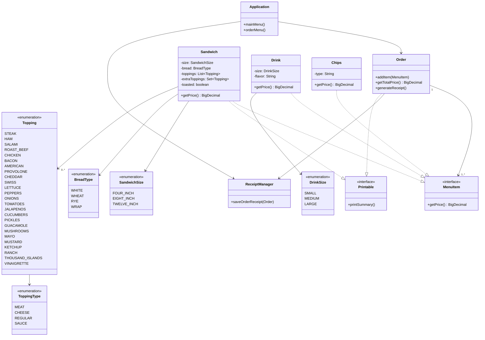

# 🥪 Custom Sandwich Shop POS (Capstone 2)

Sandwich Shop is a Java-based command-line point-of-sale (POS) system for a custom sandwich shop. Customers can fully
customize their orders with sandwich size, bread, toppings, drinks, and chips. The application follows Object-Oriented
Programming principles and saves each order as a timestamped receipt.

This project was created as part of **Advanced Java OOP Capstone 2**.

## ✨ Features

- 🧾 Create and manage customer orders
- 🥖 Fully customizable sandwiches (size, bread, toppings, toasting)
- 🧀 Extra meats and cheeses with price adjustments
- 🥤 Add drinks and chips to orders
- 💵 Accurate price calculation using `BigDecimal`
- 🧃 Display full order summary and total price
- 📄 Generate and store receipts as timestamped `.txt` files
- 🧩 Modular architecture using enums, interfaces, and services

## 📺 User Interface Flow

### Home Menu

```text
1. New Order
2. Exit
```

### Order Menu

```text
1. Add Sandwich
2. Add Drink
3. Add Chips
4. Checkout
5. Cancel Order
```

### Add Sandwich Flow

- Select bread: `WHITE`, `WHEAT`, `RYE`, `WRAP`
- Select size: `4"`, `8"`, `12"`
- Add meats, cheeses, sauces, and regular toppings
- Add extras (with extra cost)
- Choose whether to toast

### Checkout

- View order summary
- Confirm and generate a receipt

## 🧰 Technologies Used

- Java 17+
- Java OOP (Encapsulation, Inheritance, Polymorphism)
- CLI interface
- BigDecimal for currency precision
- File I/O for receipt generation
- Git & GitHub for version control

## 📁 Project Structure

```text
sandwich-shop-cli/
├── docs/
│   └── sandwich-shop-diagram-dark.svg
│   └── sandwich-shop-diagram-light.svg
├── src/
│   └── main/
│       ├── java/
│       │   └── com/delicious/
│       │       ├── app/
│       │       ├── contract/
│       │       ├── interfaces/
│       │       ├── model/
│       │       │   └── enums/
│       │       ├── service/
│       │       └── ui/
│       └── resources/
├── test/
├── .gitignore
├── pom.xml
├── README.md
└── sandwich-shop-cli.iml

```

## 🧩 UML Class Diagram

The project follows an object-oriented design, and the structure is represented in the following diagram:

<details>
  <summary>🧩 UML Class Diagram Dark Mode (click to expand)</summary>


</details>

<details>
  <summary>🧩 UML Class Diagram Light Mode (click to expand)</summary>


</details>

<details> <summary>🧩 UML Class Diagram (click to expand)</summary>


    
</details>

## 🤝 Contributions

This project is a solo capstone, but feedback and forks are welcome.
