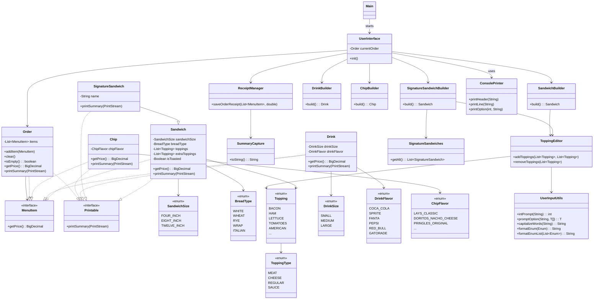

# 🥪 Sandwich Shop CLI – Custom Sandwich POS System

Welcome to the Sandwich Shop CLI, a fully interactive command-line application built in Java. It’s designed to let users
create their perfect sandwich, choose a drink and chips, and view a detailed receipt of their order.

This project was created for the Advanced Java OOP Capstone 2 course. It highlights clean object-oriented design,
modular structure, and a user-friendly experience through a simple text-based interface.

---

## ✨ Features

- Build your own sandwich by selecting the bread, size, toppings, and extras
- Option to toast your sandwich and fully customize ingredients
- Choose from a list of Signature Sandwiches like BLT, Philly, or Veggie
- Modify signature sandwiches by adding or removing toppings
- Add drinks from a selection of flavors and sizes
- Pick from a variety of classic chip flavors
- Accurate pricing handled with `BigDecimal`
- View a full order summary before confirming
- Generates a timestamped receipt for every order
- Look up past receipts using the receipt number
- Designed with modular, maintainable code (Interfaces, Enums, Builders)
- Includes unit tests with JUnit and well-documented with JavaDoc

---

## 🧭 Menu Flow Overview

### Home Menu

``` textmate
[1] - New Order
[2] - View Receipt by ID
[0] - Exit
```

---

### Order Menu

```textmate
[1] - Add Sandwich
[2] - Add Signature Sandwich
[3] - Add Drink
[4] - Add Chips
[5] - Checkout
[0] - Cancel Order
```

---

## 📄 Sample Receipt

```textmate
=== Order Receipt ===
Date: 2025-05-23 16:54:36

Sandwich:
- Size: 12" inches
- Bread: Wheat
- Toasted: Yes
- Toppings: Salami, Steak, Provolone, Mayo
- Extra Toppings: Salami, Provolone
- Price: $19.15
Sandwich:
- Size: 12" inches
- Bread: Italian
- Toasted: Yes
- Toppings: Steak, American
- Extra Toppings: American
- Price: $14.65
Drink: Red Bull (Large) - $3.00
Drink: Fanta (Small) - $2.00
Chips: Kettle Sea Salt - $1.50
Chips: Takis Fuego - $1.50

TOTAL: $41.80
```

---

# ✅ Project Task Tracker

📋 **[View TODO List](TODO.md)** – Stay on top of tasks and keep track of project progress

---

## 📁 Project Structure

```text
  sandwich-shop-cli/
  ├── docs/                          # UML diagrams, design notes
  ├── src/
  │   ├── main/
  │   │   ├── java/
  │   │   │   ├── app/               # Entry points
  │   │   │   ├── data/              # Data loaders and static content
  │   │   │   ├── gui/               # JavaFX GUI layer
  │   │   │   │   ├── helpers/       # Shared dialog/utility helpers
  │   │   │   │   ├── screens/       # JavaFX scenes
  │   │   │   │   └── util/          # Layout widgets (e.g., styled VBox)
  │   │   │   ├── interfaces/        # Shared contracts
  │   │   │   ├── models/            # Domain models (Sandwich, Drink, Chip)
  │   │   │   │   ├── enums/         # Enum types (flavors, sizes, toppings)
  │   │   │   ├── builders/          # Sandwich/Drink/Chip builders (used in CLI)
  │   │   │   ├── persistence/       # File I/O and order storage
  │   │   │   ├── ui/                # CLI interaction handlers
  │   │   │   └── utils/             # CLI-only utilities
  │   │   └── resources/             # Non-Java resources
  │   │       ├── receipt/           # Saved receipts
  │   │       └── styles/            # CSS for JavaFX
  │   └── test/                      # JUnit tests
  │       ├── builders/
  │       ├── data/
  │       ├── models/
  │       ├── persistence/
  │       ├── ui/
  │       └── utils/
  ├── .gitignore
  ├── README.md
  ├── TODO.md
  ├── EXTRAS.md
  ├── pom.xml
```

---

## 🧩 UML Class Diagram

<details>
  <summary>Class Diagram (Dark Mode) – Click to view</summary>


</details>

<details>
  <summary>Class Diagram (Light Mode) – Click to view</summary>


</details>

<details>
  <summary>Class Diagram (Interactive View) – Click to explore</summary>


</details>

---

# 🔧 Built With

The Sandwich Shop CLI is built using modern Java tools and best practices:

- **Java 17+** – Core language features and improvements
- **Maven** – Manages builds, dependencies, testing, and documentation
- **BigDecimal** – Ensures precise currency calculations
- **File I/O** – Stores receipts with automatic timestamps
- **Functional Interfaces** – Used for clean abstraction in `MenuItem` and `Printable`
- **IntelliJ IDEA** – Full-featured development environment with Git, Maven, and terminal integration

---

# 🤝 Contributing

This project was built as a **solo capstone**, but you're more than welcome to:

- Fork it and use it for your own learning
- Expand it into a desktop application or a RESTful API
- Share ideas or suggestions to help improve future versions

Pull requests are always welcome and appreciated ❤️

---

# 📌 Future Improvements

Here are a few fun and practical features planned for future updates:

- **GUI Version**
    - Add a drag-and-drop interface for customizing sandwiches

- **Database Integration**
    - Store orders with SQLite or PostgreSQL
    - Enable order history, search, and basic reporting

---

Thanks for checking out this project!  
If it sparks ideas for your own CLI app or POS system, that’s already a win. 😄