# 🥪 sandwich-shop-cli — Custom Sandwich Shop POS (Capstone 2)

Welcome to the **Sandwich Shop CLI**, a fully functional Java command-line POS system designed for a custom sandwich
shop experience. Users can build sandwiches to their liking, add drinks and chips, and receive a fully itemized receipt.
🧾

This application was developed as part of the **Advanced Java OOP - Capstone 2** project and is a showcase of clean
object-oriented design, modularity, and user-friendly interaction through a text-based interface.

---

## ✨ Features

- 🍞 Build-your-own sandwiches (bread, size, toppings, extras)
- 🔥 Toasting option and customizable toppings
- 🥪 Choose from a menu of Signature Sandwiches (BLT, Philly, Veggie, etc.)
- ➕ Modify signature sandwiches (add/remove toppings)
- 🥤 Add drinks from a curated flavor list and sizes
- 🍟 Include chips from a variety of classic flavors
- 💰 Accurate pricing using `BigDecimal`
- 📋 Order summary and confirmation screen
- 📄 Receipt generation stored with timestamps
- 🔍 Lookup past receipts by receipt number
- 🧩 Modular and maintainable structure (Interfaces, Enums, Builders)
- 🧪 Ready for JUnit testing and JavaDoc documentation
---

## 🧭 Menu Flow Overview

### Home Menu

``` textmate
[1] - New Order
[0] - Exit
```
---

### Order Menu

```textmate
[1] - Add Sandwich
[2] - Add Signature Sandwich
[3] - Add Drink
[4] - Add Chips
[5] - Checkout
[0] - Cancel Order
```
---

### Sandwich Customization

```textmate
- Select `BreadType`: WHITE, WHEAT, RYE, WRAP, ITALIAN
- Select `SandwichSize`: 4", 8", 12"
- Add/remove meats, cheeses, sauces, and regular toppings
- Add extras (optional)
- Choose whether to toast
```
---

## 📄 Sample Receipt

```textmate
=== Order Summary ===
Sandwich:
Size: 12" inches
Bread: Wheat
Toasted: Yes
Toppings: Steak, Swiss, Lettuce, Tomatoes
Extra Toppings: Swiss
Price: $11.75
Drink: Sprite (Medium) - $2.50
Chips: Doritos Nacho Cheese - $1.50

TOTAL: $15.75
```
---

# ✅ Project Task Tracker

📋 **[View TODO list](TODO.md)** — Track ongoing tasks and project progress

---

## 🚧 Receipt and Persistence

- [x] Create `ReceiptManager` class for file I/O
- [x] Implement timestamped `.txt` receipts
- [x] Capture formatted order summaries with `SummaryCapture`

---

## 🚧 User Interface

- [x] CLI-based navigation (`UserInterface`)
- [x] Modular CLI sections: Add sandwich, drink, chip, signature
- [x] Add order summary & confirmation
- [x] Extract reusable prompt utilities
- [x] Clean CLI output with `ConsolePrinter`

---

## 🚧 Testing & Polish

- [ ] Add JUnit tests:
    - [ ] `getPrice()` methods (sandwich, drink, chips)
    - [ ] `ReceiptManager`
    - [ ] `Order`
- [ ] Add CLI usability edge cases
- [ ] Final code cleanup and consistent Javadoc

---

## 🚧 Bonus Features

- [x] Add Signature Sandwiches
- [x] Allow topping modifications (add/remove on any sub)
- [ ] Add combo deals, discounts, nutrition facts

---

## 📁 Current Project Structure

```text
sandwich-shop-cli/
├── src/
│   ├── main/
│   │   ├── java/
│   │   │   └── app/                 # Main launcher
│   │   │   └── builders/            # Builders for Sandwich, Drink, Chip, Signature
│   │   │   └── data/                # Signature sandwich data source
│   │   │   └── interfaces/          # MenuItem, Printable
│   │   │   └── models/              # Core models
│   │   │   │   └── enums/           # All enum types (Topping, Sizes, etc.)
│   │   │   └── persistence/         # ReceiptManager & summary output
│   │   │   └── ui/                  # CLI controller (UserInterface)
│   │   │   └── utils/               # ToppingEditor, UserInputUtils, ConsolePrinter
│   │   └── resources/              # Saved receipts
├── docs/                           # UML diagrams and design notes
├── test/                           # (Upcoming) Unit tests
├── README.md
├── TODO.md
├── EXTRAS.md
├── pom.xml
└── .gitignore
```
---

## 🧩 UML Class Diagram

<details>
  <summary>Class Diagram: Dark Mode — Click to expand</summary>



</details>

<details>
  <summary>Class Diagram: Light Mode — Click to expand</summary>



</details>

<details>
  <summary>Class Diagram: Interactive — Click to expand</summary>


</details>

---

## 📚 JavaDoc Documentation

You can generate the full JavaDoc with:

```bash
  mvn javadoc:javadoc
```

#

---
# 🧪 Testing Plans

To ensure reliability and correctness, the following JUnit test cases are planned:

### ✅ Unit Tests
- **Sandwich Pricing Logic**
    - Validate price calculation based on size, toppings, extras
    - Test edge sizes (4", 8", 12") with all combinations

- **Receipt Output Validation**
    - Capture and verify printed output using `SummaryCapture`
    - Confirm formatting and price display consistency

- **User Input Utilities**
    - Test input range validation
    - Ensure proper error messages for invalid inputs
    - Simulate promptOption and enum formatting

### 🧱 Boundary & Edge Case Testing
- Empty orders should return $0.00 total
- Out-of-bounds selection in any menu should prompt again
- Empty toppings list should still produce a valid sandwich
- Canceling during different stages should clear the order safely

### 💡 CLI Usability Testing
- Test full order creation from start to receipt
- Validate input navigation (back to home/cancel)
- Ensure confirmation prompts are clearly labeled

---

# 🔧 Built With

The sandwich-shop-cli is developed using modern Java tooling and best practices:

- **Java 17+** — Core language and feature support
- **Maven** — Build lifecycle, dependency management, testing, and JavaDoc
- **BigDecimal** — Accurate currency calculations
- **File I/O** — Timestamped receipt persistence
- **Functional Interfaces** — Cleaner abstraction for `MenuItem`, `Printable`
- **IntelliJ IDEA** — Development environment with integrated terminal, Git, and Maven support

---

# 🤝 Contributing

This project was created as a **solo capstone project**.  
That said — you’re more than welcome to:

- Fork it for your own learning
- Expand it into a desktop app or RESTful API
- Submit ideas or improvements for future versions

Pull requests are always reviewed with appreciation. ❤️

---

# 📌 Future Improvements

Here are some fun and practical features planned for future releases:

- 🍽 **Combo Deals & Discounts**
    - Automatically apply deals for meal combos
    - Add coupon or promo code support

- 🧮 **Nutrition Info**
    - Show calorie counts per topping or drink
    - Include allergens in printed receipts

- 💻 **GUI Version**
    - Build a Swing/JavaFX desktop version
    - Drag-and-drop topping UI for customization

- 🗃 **Database Integration**
    - Persist orders using SQLite or PostgreSQL
    - Enable order history and reporting features

---

Thank you for checking out this project! If it inspires your own CLI adventure or POS app — that’s a win already. 😄

